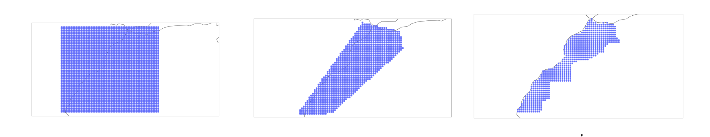

# dashboard-AgriEdge-data

After performing the clustering of crop years weather data for a given region and generalizing this procedure to multiple regions, the goal now is to gather all these results in a dashboard.

This repository is meant to prepare data to be displayed in the dashboard.

# Table of content

1. <a href="#generate-moroccan-data">Generate Moroccan regions</a>
2. <a href="#fetch-preprocess-data">Fetch and preprocess Moroccan weather data</a>

# Generate Moroccan regions

Moroccan regions, namely their locations (latitude and longitude), were generated with a spatial resolution of **0.3°**. 

According to [NASA Power project](https://power.larc.nasa.gov/), the meteorological data has a spatial resolution of **0.5°x0.5°**. I found that **0.3°** is a trade-off between resolution - visual appearance - and the number of regions.

Steps to generate Moroccan regions with the specified resolution:
1. Firstly, I generated a square grid with resolution **0.3°x0.3°**
2. Secondly, I selected points that belong to a polygon that delimits Morocco. The main reason for that is to reduce the number of points.
3. Finally, using an [API](https://positionstack.com/) that maps coordinates with the name of the location, I was able to refine further the grid by eliminating the points that do not belong to Morocco.

I gathered these regions in a *dataframe --> .csv file*. The dataframe contains a total of **705** locations where the latitude, longitude, region, and name are specified.

# Fetch and preprocess Moroccan weather data

Weather data was downloaded from [NASA Power project](https://power.larc.nasa.gov/) by requesting directly the server. The Preprocessing of data include adapting the weather data to the **wheat calendar** and adding the cumulative sum of each weather variable. Further details about data preprocessing can be found in the repository [Multivariate time series clustering of weather data](https://github.com/Badr-MOUFAD/multivariate-time-series-clustering).

The weather data of each location is stored separately in .csv file. All .csv are located in the folder [`raw_data/weather_regions/`](https://github.com/Badr-MOUFAD/dashboard-AgriEdge-data/tree/master/raw_data/weather_regions)

